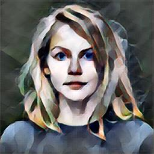
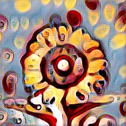
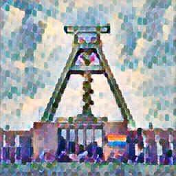

Fast Style Transfer (Johnson et al, 2016)
=========================================
This repository contains a simple implementation of Johnson's style transfer
model in PyTorch.  For a detailed description, have a look at my repository
[`johnson-fast-style-transfer`](https://github.com/mdehling/johnson-fast-style-transfer).

> [!NOTE]
> This repository contains a demo notebook.  There are two simple ways to run it
> without installing any software on your local machine:
>
> 1. View the notebook on GitHub and click the _Open in Colab_ button (requires
>    a Google account).
> 2. Create a GitHub Codespace for this repository and run the notebook in
>    VSCode (requires a GitHub account).

Usage
-----
The easiest way to load this model is using torch hub as follows.

    $ python
    Python 3.10.13 (main, Sep 20 2023, 11:11:20) [GCC 12.2.0] on linux
    Type "help", "copyright", "credits" or "license" for more information.
    >>> import torch
    >>> GH_REPO = 'mdehling/johnson-fast-style-transfer-pytorch'
    >>> print( torch.hub.help(GH_REPO, 'johnson2016') )

        Johnson et al (2016) Fast Style Transfer.

        Args:
            style:
                A string indicating which pre-trained model to load.  One of:
                `'bathing'`, `'candy'`, `'cubism'`, `'delaunay'`, `'scream'`,
                `'starry-night'`, or `'udnie'`.

        Returns:
            A pre-trained model for the indicated style.  The model takes a tensor
            of shape `(B,C,H,W)` representing a batch of content images and returns
            a tensor of the same shape representing the generated pastiche images.

        References:
            * Johnson, Alahi, Fei-Fei.  "Perceptual Losses for Real-Time Style
                Transfer and Super-Resolution."  ECCV, 2016.
            * Ulyanov, Vedaldi, Lempitsky.  "Instance Normalization: The Missing
                Ingredient for Fast Stylization."  Arxiv, 2016.

    >>> model = torch.hub.load(GH_REPO, 'johnson2016', style='delaunay')

Samples
-------

Training
--------
The included training script uses the hydra package for easy configuration
management.  To train a style transfer model for a single style image, run
`./train.py style_image=candy.jpg`.  To see available options, run
`./train.py --help`.  To train style transfer models for a range of style
images, run the following command:

    ./train.py --multirun style_image=bathing.jpg,candy.jpg,cubism.jpg,delaunay.jpg,scream.jpg,starry-night.jpg,udnie.jpg

The directory `multirun` contains the results of this exact command.
